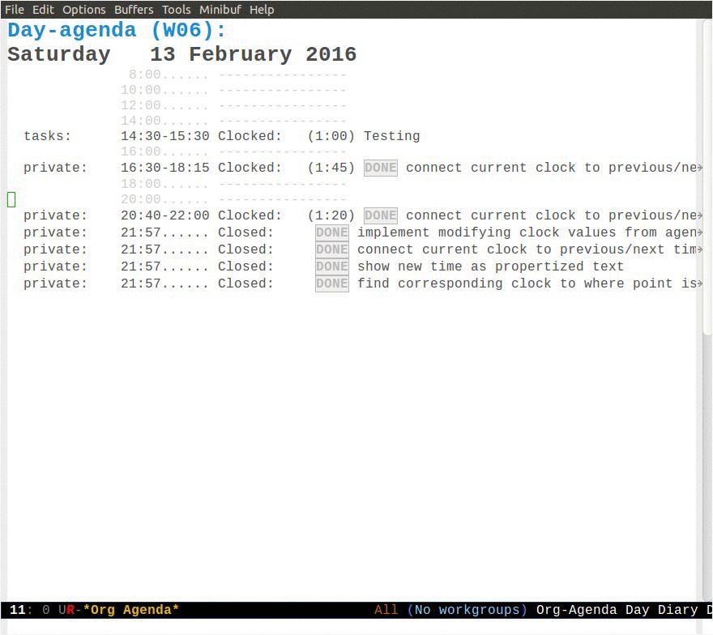

<h2>Table of Contents</h2>

<ul>
<li><a href="#orgheadline1">1. Introduction</a></li>
<li><a href="#orgheadline2">2. Motivation</a></li>
<li><a href="#orgheadline3">3. Interactive functions</a></li>
<li><a href="#orgheadline4">4. Installation</a></li>
<li><a href="#orgheadline5">5. Current shortcomings</a></li>
</ul>

# Introduction

This is a collection of functions I am writing in order to make my
clocking workflows easier.

My aim is to do as much of the clocking from the agenda buffer
without ever having to leave it, except to open a new task.

# Motivation

It happens quite often that I get distracted by other tasks, e.g. a
colleague ivolving me in a longer discussion, while I am still
clocked in to the previous task. So, frequently I need to adapt the
clock history to fill gaps or to correct for tasks happening when I
was not in front of the screen. I want to have my whole day clocked
seemlessly, and I have done so over the last 4 years using Org.
Formerly, this involved a lot of jumping to the clock lines of org
files to adapt the timestamps, which is cumbersome and needs time.

I always wanted to have commands with which I can change the clock
values directly **from the log lines in the agenda view** in the same
way that one can change timestamps under the cursor inside of an org
file using `org-timestamp-up` and `org-timestamp-down` (usually
mapped to `<S-up>` and `<S-down>`).

# Interactive functions

-   `org-clock-conv-timestamp-up` and `org-clock-conv-timestamp-down`:
    When on a *clocked* line in the agenda buffer, this function will
    increase/decrease the time according to the position of the
    cursor. If the cursor is on the hour field, change the hour. If it
    is on the minutes field, change the minutes. Undo works on the
    agenda and on the source buffer.
-   `org-clock-conv-fill-gap` modifies the timestamp at point to
    connect to the previous/next logged timerange.
-   `org-clock-conv-goto-ts` goto the associated timestamp in the org
    file. Position the cursor respective to where the cursor was
    placed in the agenda view (e.g. on the minutes part of the
    starting time).
-   `org-clock-conv-goto-last-clockout`: goto timestamp of the last
    clockout (this is based on a real search through the buffer and
    not based on the saved clockout value).

The package also contains a number of utility functions to associate
a list with fieldnames with the subgroup of a regular expression and
position point at a named field or read its value.

# Installation

-   I am currently preparing packaging for MELPA.
-   You can always install the raw package an then do
    
        (require 'org-clock-convenience)

I did not include a minor mode, since I think that these commands will be bound
in a very individual way by users. I recommend defining a setup function and
adding it to the functions run by `org-agenda-mode-hook` like here:

    (defun dfeich/org-agenda-mode-fn ()
      (define-key org-agenda-mode-map
        (kbd "<S-up>") #'org-clock-conv-timestamp-up)
      (define-key org-agenda-mode-map
        (kbd "<S-down>") #'org-clock-conv-timestamp-down)
      (define-key org-agenda-mode-map
        (kbd "ö") #'org-clock-conv-fill-gap))
    (add-hook 'org-agenda-mode-hook #'dfeich/org-agenda-mode-fn)

# Current shortcomings

-   Agenda view sometimes needs two rebuilds after modifying. This is
    a minor invonvenience, and I need to investigate.